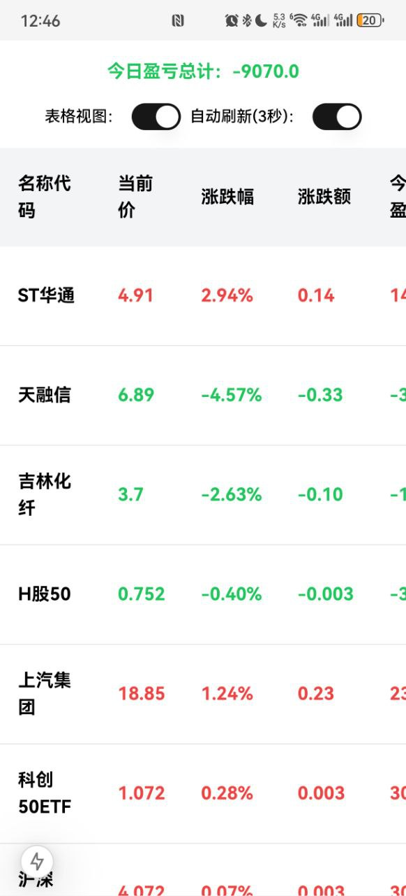

## A 股实时行情

每 3 秒定时刷新 A 股行情，支持多个股票代码，支持设置持仓以计算当日盈亏。

不存储任何数据，使用公开行情数据 api（新浪财经）。

基于 Next.js 开发，服务端渲染技术。

## 表格视图


## 卡片视图


## 移动端



## 运行

```bash
podman run -it --name stock-realtime --rm --replace --network host docker.io/arloor/stock-realtime
```

访问 http://your_ip:9999/?code=sz399001&code=sh000001&autoRefresh=true

## 调试

```bash
npm install -g pnpm
pnpm i
pnpm dev
```

## docker 镜像编译

```bash
podman login docker.io -u arloor -p ${your_docker_hub_token}
podman build -f Dockerfile . -t docker.io/arloor/stock-realtime --build-arg=PORT=9999 --network host #podman的命令会使用系统代理来拉取node modules和下载alpine的apk包
podman push docker.io/arloor/stock-realtime:latest
```
