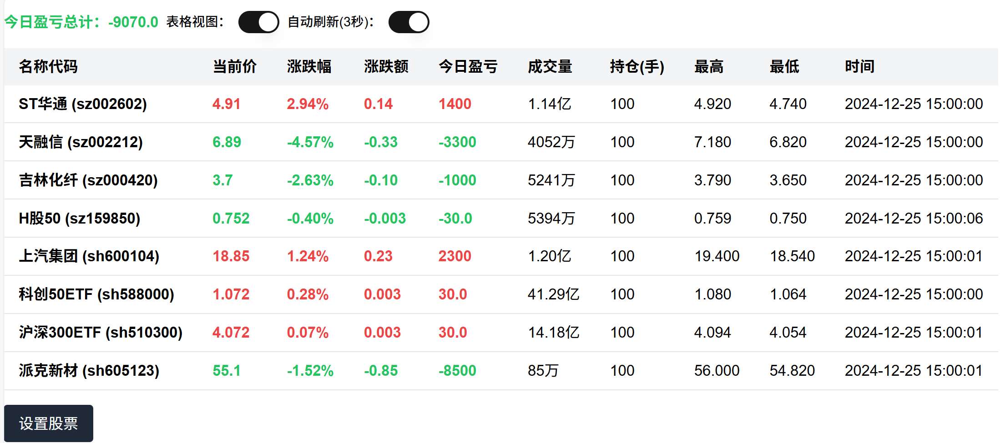

## A股实时行情




## 运行

```bash
podman run -it --name stock-realtime --rm --replace --network host docker.io/arloor/stock-realtime
```

访问 http://your_ip:9999/?code=sz399001&code=sh000001&autoRefresh=true

## 调试

```bash
npm install -g pnpm
pnpm i
pnpm dev
```

## docker镜像编译

```bash
podman build -f Dockerfile . -t docker.io/arloor/stock-realtime --build-arg=PORT=9999 --network host #podman的命令会使用系统代理来拉取node modules和下载alpine的apk包
podman login docker.io -u arloor -p ${your_docker_hub_token}
podman push docker.io/arloor/stock-realtime:latest
```